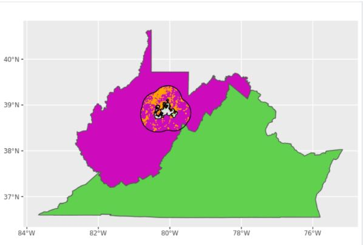

# Ookla Speedtest Data
Ookla collects data on the results of their Speedtest which is then made available publicly each quarter. This data is aggregated into tiles of roughly 600 by 600 square meters. With each tile, Ookla lists data on the average download and upload speeds as well as latency time. Additionally, Ookla provides information on the number tests run on each tile as well as the number of distinct devices on which tests were run, making it possible to weight each tile depending on how many devices were used to calculate average speeds. For our analysis of the effect of broadband grants on internet speeds we took a subset of Ookla data which was collected from the years 2019 to 2021 and was within a 5 mile buffer region around the project area of interest.
 
{width=50% }

https://www.ookla.com/ookla-for-good/open-data
 

# CoreLogic Residential Property Tax Data
#### Exploratory Data Analysis of CoreLogic Property Tax Data

The CoreLogic Property Tax Data is internally divided into two datasets with assessed years of 2006-2014 and 2019-2021, corresponding to the Broadband Initiative Program and Community Connect Project, respectively. Our initial analysis was focused on Community Connect, thus, the exploratory data analysis tables below of the numeric variables represent assessed dates from 2019-2021. 

 

# Shapefiles
Throughout the course of the project, we worked chiefly with data in the form of shapefiles. These files allowed us to calculate variables such as area, intersections, and distance. Below are some images of these shapefiles constructed using ggplot2. 

## Project Area Shapefiles
This plot outlines the appearance of the project area we dealt with when looking at Ookla data as well as a 5 mile buffer around the region to which inside speeds were compared.
 
{width=50% }

## Ookla Shapefiles
Here we haved plotted the Ookla tiles for which we have observations. The time period for this plot is the fourth quarter of 2021.
 
{width=50% }

## State Shapefiles
This plot illustrates the location and size of the project area in relation to surrounding states.
{width=50% }

## ACS Tract Shapefiles
The values for the demographic variables linked to Ookla tiles were derived from the values associated with the tract in which the tile fell.
 
{width=50% }

## Park and Forest Shapefiles
When it appeared that our housing data had holes in it, we overlaid maps of parks and forests which helped to explain the lack of homes in certain areas, as demonstrated below.
 
{width=50% }

 

