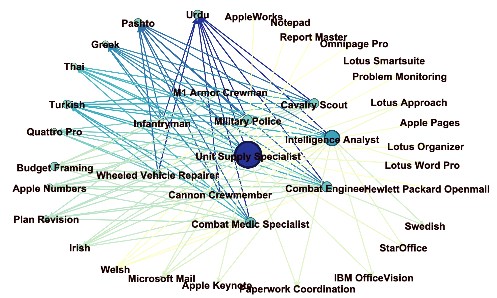

```{js echo=FALSE}
   document.getElementsByTagName('a')[0].innerHTML = ''
   document.getElementsByClassName('navbar-header')[0].style = 'margin-top:-10px;'
```

The second piece of our analysis starts with learning about software and specialized skill. This was a definition from Burning Glass and includes more specific skills than those of their baseline definition. These are highly employable skills and therefore important to Veterans for their resumes.

```{r, echo=FALSE}
knitr::opts_chunk$set(echo = FALSE)
knitr::opts_chunk$set(warning = FALSE, message = FALSE) 
knitr::opts_knit$set(root.dir = rprojroot::find_rstudio_root_file())
root.dir = rprojroot::find_rstudio_root_file()
```

```{r setup, include=FALSE}
setwd(root.dir)
library(data.table)
library(tidytable)
library(maditr)
library(tidyverse)
library(readxl)
library(ggplot2)
library(stargazer)

mos_skills<-readRDS("./data/working/mos_skill.Rds") %>% as.data.table()
soc_skills<-readRDS("./data/working/soc_skill_bls_long.Rds")%>% as.data.table()
skill_uq<-read_csv("./data/working/skill_network_unique.csv") %>% as.data.table()
all_skills_mos<-readRDS("./data/working/all_mos_skill_long.Rds") %>% as.data.table()
all_skills_soc<-readRDS("./data/working/all_soc_skill_bls_long.Rds") %>% as.data.table()
all_skill_uq<-read_csv("./data/working/all_skill_unique.csv")
all_skill<-read_csv("./data/working/all_skill_mos_network.csv")

colors <- c("#232d4b","#2c4f6b","#0e879c","#60999a","#d1e0bf","#d9e12b","#e6ce3a","#e6a01d","#e57200","#fdfdfd")
distinct_col<-c("#000000", "#696969","#556b2f", "#a0522d", "#7f0000", "#191970", "#808000", "#008000", "#008080",
                "#4682b4", "#9acd32", "#00008b", "#daa520", "#7f007f", "#8fbc8f", "#b03060", "#d2b48c", "#ff4500",
                "#00ced1", "#ff8c00", "#6a5acd", "#ffff00", "#0000cd", "#00ff00", "#ba55d3", "#00ff7f", "dc143c")

mos_1<-c("Cannon Crewmember", "Cavalry Scout", "Combat Engineer", "Combat Medic Specialist", "Infantryman")
mos_2<-c('Intelligence Analyst', "M1 Armor Crewman", "Military Police", "Unit Supply Specialist", "Wheeled Vehicle Repairer")
```


###  Exploratory Data Analysis
```{r All Skills Employment Statistics, echo=FALSE}
all_skills_wage<-all_skills_soc %>% select(socname, tot_emp, a_mean) %>% unique()
all_skills_wage<-all_skills_wage[complete.cases(all_skills_wage), ]
all_skills_wage[,3]<-sapply(all_skills_wage[,3], as.numeric)
```

```{r stargaxer, results="asis"}
Variables <- c("Employment", "Salary")
summary_table <- data.frame(Variables)
summary_table$Mean[1] <- mean(all_skills_wage$tot_emp)
summary_table$Mean[2] <- mean(all_skills_wage$a_mean)
summary_table$SD[1] <- sd(all_skills_wage$tot_emp)
summary_table$SD[2] <- sd(all_skills_wage$a_mean)
summary_table$Min[1] <- min(all_skills_wage$tot_emp)
summary_table$Min[2] <- min(all_skills_wage$a_mean)
summary_table$Max[1] <- max(all_skills_wage$tot_emp)
summary_table$Max[2] <- max(all_skills_wage$a_mean)

knitr::kable(summary_table)
```

#### All Skills
```{r All Skills Frequency, echo=FALSE}
freq_all_skill<-table(all_skills_mos$skill) %>% as.data.table()
freq_all_skill<-freq_all_skill[order(-N)] %>% top_n(10)
ggplot(freq_all_skill, aes(x=reorder(V1, -N), y=N))+geom_bar(stat='identity', fill=colors[1]) +
  labs(x = "Skill Frequency", y = NULL, title = "Army SOC Code Skills (All) Frequency")+
  scale_x_discrete(labels = str_wrap(freq_all_skill$V1, width = 8))+
  guides(x =  guide_axis(angle = 45))
```


Many of the top skills overall are also the top baseline skills (communication skills, physical ability, organizational skills, detail-oriented, English), indicating the importance of many of these baseline skills in the workforce.


#### Specialized Skills
```{r Specialized Skill Frequency, echo=FALSE}
all_skills_mos_specialized<-all_skill %>% filter.(skill_type == "Specialized")
freq_specialized_skill<-all_skills_mos_specialized %>% select(target, freq) %>% as.data.table()
freq_specialized_skill<-freq_specialized_skill[order(-freq)] %>% unique() %>% top_n(10)
ggplot(freq_specialized_skill, aes(x=reorder(target, -freq), y=freq))+geom_bar(stat='identity', fill=colors[1]) +
  labs(x = "Skill Frequency", y = NULL, title = "Army SOC Code Skills (Specialized)")+
  scale_x_discrete(labels = str_wrap(freq_specialized_skill$target, width = 8))+theme(text=element_text(size=9))+
  guides(x =  guide_axis(angle = 45))+ylim(0, 700)
```
Some of the most common specialized skills include cleaning, repair and teamwork. It's worth noting that these skills occur at a much lower rate than any of the baseline skills, implying that the baseline skills still carry more weight and value in the workforce.


```{r, fig.height=10, echo=FALSE}
all_skills_mos_specialized %>%
  na.omit()%>%
  select(target, source, e_freq) %>%
  filter(source %in% mos_2) %>%
  group_by(target) %>%
  mutate(freq = sum(e_freq)) %>%
  ungroup() %>%
  group_by(source) %>%
  unique()%>%
  slice_max(freq, n = 5) %>%
  ungroup() %>%
  ggplot(aes(freq, fct_reorder(target, freq), fill = source)) +
  scale_fill_manual(values=colors) +
  geom_col(show.legend = FALSE) +
  facet_wrap(~source, ncol = 1, scales = "free") +
  labs(x = "Skill Frequency Weighted by Employment", y = NULL,
       title = "Army SOC Code Skills")
```

```{r, fig.height=10, echo=FALSE}
all_skills_mos_specialized %>%
  na.omit()%>%
  select(target, source, e_freq) %>%
  filter(source %in% mos_1) %>%
  group_by(target) %>%
  mutate(freq = sum(e_freq)) %>%
  ungroup() %>%
  group_by(source) %>%
  unique()%>%
  slice_max(freq, n = 5) %>%
  ungroup() %>%
  ggplot(aes(freq, fct_reorder(target, freq), fill = source)) +
  scale_fill_manual(values=colors) +
  geom_col(show.legend = FALSE) +
  facet_wrap(~source, ncol = 1, scales = "free") +
  labs(x = "Skill Frequency Weighted by Employment", y = NULL,
       title = "Army SOC Code Skills")
```

The top 5 specialized skills for each MOS are approximately the same once weighted by employment, implying that regardless of the MOS, they utilize similar sets of specialized skills.


####  Software Skills
```{r Software Skill Frequency, echo=FALSE}
all_skills_mos_software <- all_skill %>% filter.(skill_type=="Software")
freq_software_skill<-all_skills_mos_software %>% select(target, freq) %>% as.data.table()
freq_software_skill<-freq_software_skill[order(-freq)] %>% unique() %>% top_n(10)
ggplot(freq_software_skill, aes(x=reorder(target, -freq), y=freq))+geom_bar(stat='identity', fill=colors[1]) +
  labs(x = "Skill Frequency", y = NULL, title = "Army SOC Code Skills (Software)")+
  scale_x_discrete(labels = str_wrap(freq_software_skill$target, width = 8))+
  guides(x =  guide_axis(angle = 45))+theme(text=element_text(size=9))+ylim(0, 700)
```

By far the highest occurrence of a software skill is that of SAP, which is a business software. Combined with the presence of Salesforce and ERP, indicates a demand for software centered around commerce and business. These also occur at a much lower rate than the baseline skills, which indicates that they are still not as ubiquitous as the baseline skills


```{r, fig.height=10, echo=FALSE}
all_skills_mos_software %>%
  na.omit()%>%
  select(target, source, e_freq) %>%
  filter(source %in% mos_1) %>%
  group_by(target) %>%
  mutate(freq = sum(e_freq)) %>%
  ungroup() %>%
  group_by(source) %>%
  unique()%>%
  slice_max(freq, n = 5) %>%
  ungroup() %>%
  ggplot(aes(freq, fct_reorder(target, freq), fill = source)) +
  scale_fill_manual(values=colors) +
  geom_col(show.legend = FALSE) +
  facet_wrap(~source, ncol = 1, scales = "free") +
  labs(x = "Skill Frequency Weighted by Employment", y = NULL,
       title = "Army SOC Code Skills")
```

```{r, fig.height=10, echo=FALSE}
all_skills_mos_software %>%
  na.omit()%>%
  select(target, source, e_freq) %>%
  filter(source %in% mos_2) %>%
  group_by(target) %>%
  mutate(freq = sum(e_freq)) %>%
  ungroup() %>%
  group_by(source) %>%
  unique()%>%
  slice_max(freq, n = 5) %>%
  ungroup() %>%
  ggplot(aes(freq, fct_reorder(target, freq), fill = source)) +
  scale_fill_manual(values=colors) +
  geom_col(show.legend = FALSE) +
  facet_wrap(~source, ncol = 1, scales = "free") +
  labs(x = "Skill Frequency Weighted by Employment", y = NULL,
       title = "Army SOC Code Skills")
```

The top 5 software skills are also the same for each MOS, and reflect the top software skills overall. However, once weighted by employment and salary, they have a very low weighted score. This could be that in terms of salary or employment projection, they are not as high as other skills.


####  Unique Skills
```{r, fig.height=10, echo=FALSE}
all_skill_uq %>%
  na.omit()%>%
  select(target, source, e_freq) %>%
  filter(source %in% mos_1) %>%
  group_by(target) %>%
  mutate(freq = sum(e_freq)) %>%
  ungroup() %>%
  group_by(source) %>%
  unique()%>%
  slice_max(freq, n = 5) %>%
  ungroup() %>%
  ggplot(aes(freq, fct_reorder(target, freq), fill = source)) +
  scale_fill_manual(values=colors) +
  geom_col(show.legend = FALSE) +
  facet_wrap(~source, ncol = 1, scales = "free") +
  labs(x = "Unique Skill Frequency Weighted by Employment", y = NULL,
       title = "Army SOC Code Skills")
```

```{r, fig.height=10, echo=FALSE}
all_skill_uq %>%
  na.omit()%>%
  select(target, source, e_freq) %>%
  filter(source %in% mos_2) %>%
  group_by(target) %>%
  mutate(freq = sum(e_freq)) %>%
  ungroup() %>%
  group_by(source) %>%
  unique()%>%
  slice_max(freq, n = 5) %>%
  ungroup() %>%
  ggplot(aes(freq, fct_reorder(target, freq), fill = source)) +
  scale_fill_manual(values=colors) +
  geom_col(show.legend = FALSE) +
  facet_wrap(~source, ncol = 1, scales = "free") +
  labs(x = "Unique Skill Frequency Weighted by Employment", y = NULL,
       title = "Army SOC Code Skills")
```

Unique skills are defined as skills that aren't seen across all 10 MOS, although the most common unique skills--digital signal processing, game development, cutting in and creative writing are seen across 9 of the 10 MOS.


# Employment by MOS

BLS labor statistics were used to determine the average employment and salary for jobs associated with given skills. For each MOS, the salary and employment estimates of jobs associated with skills acquired from a MOS were averaged and used to determine average employment and 

```{r, echo=FALSE}
all_skill %>%
  na.omit()%>%
  select(target, source, employ) %>%
  filter(source %in% mos_1) %>%
  ggplot(aes(source, employ)) +
  stat_summary(fun=mean, geom="bar", fill=colors[1])+
  labs(x = "MOS", y = NULL,
       title = "Average Employment per MOS")+
  guides(x =  guide_axis(angle = 45))
```

```{r, echo=FALSE}
all_skill %>%
  na.omit()%>%
  select(target, source, employ) %>%
  filter(source %in% mos_2) %>%
  ggplot(aes(source, employ)) +
  stat_summary(fun=mean, geom="bar", fill=colors[1])+
  labs(x = "MOS", y = NULL,
       title = "Average Employment per MOS")+
  guides(x =  guide_axis(angle = 45))
```

The average predicted employment for each MOS was taken based on their skills. The highest average employment predicted was for combat medic specialists, intelligence analysts and unit supply specialists while the lowest were for M1 Armor Crewmen and Infantrymen. 


# Salary by MOS
```{r, echo=FALSE}
all_skill %>%
  na.omit()%>%
  select(target, source, salary) %>%
  filter(source %in% mos_1) %>%
  ggplot(aes(source, salary)) +
  stat_summary(fun=mean, geom="bar", fill=colors[1])+
  labs(x = "MOS", y = NULL,
       title = "Average Income per MOS")+
  guides(x =  guide_axis(angle = 45))
```

```{r, echo=FALSE}
all_skill %>%
  na.omit()%>%
  select(target, source, salary) %>%
  filter(source %in% mos_2) %>%
  ggplot(aes(source, salary)) +
  stat_summary(fun=mean, geom="bar", fill=colors[1])+
  labs(x = "MOS", y = NULL,
       title = "Average Income per MOS")+
  guides(x =  guide_axis(angle = 45))
```

Based on the salary for each MOS based on their skill, the average salary for jobs acquired by soldiers once leaving the army based on their skills is consistent across MOS. This could be due to the number of overlapping skills and jobs shared across SOC codes, which are common among all MOS.

# Baseline Skill Top 10 Percentages

Finally, we look at which skills are the top 10 skills for each MOS, and the percentage of the top 10 skill in terms of frequency. Across baseline, all specialized and software skills, we see that the overall top 10 skills are included in almost all of these individual MOS top 10 skills.

```{r, echo=FALSE}
all_skills_baseline<-all_skills_mos %>% filter.(isbaseline==TRUE)
all_skills_baseline_top<-all_skills_baseline %>% group_by(`Army MOS Title`, skill) %>%
  summarise(freq=n()) %>% select(`Army MOS Title`, skill, freq) %>% as.data.table() %>% setkey(freq)
all_skills_baseline_top<-all_skills_baseline_top[, tail(.SD, 10), by=`Army MOS Title`]
all_skills_baseline_top<-all_skills_baseline_top %>%
  mutate.(percentage=freq/sum(freq), .by=`Army MOS Title`) %>% ungroup()
ggplot(all_skills_baseline_top, aes(fill=skill, y=freq, x=`Army MOS Title`))+
  geom_bar(position='fill', stat='identity')+scale_fill_manual(values=distinct_col)+
  labs(x="Army MOS", y="Percentage", title="Percentage of Skill in the Top 10 Baseline skills for a MOS")+
  scale_x_discrete(labels=str_wrap(unique(all_skills_baseline_top$`Army MOS Title`), width=10))+
  theme(text=element_text(size=9))+guides(x =  guide_axis(angle = 45))
```

We see physical ability, communication, organization and problem solving appearing in almost each MOS's top 10 skills. We also observe that each skill has about the same percentage among the top 10 skills.


# Specialized Skills Top 10 Percentages

```{r, echo=FALSE}
all_mos_skills_specialized<-all_skills_mos %>% filter.(isspecialized==TRUE)
all_skills_mos_specialized_top<-all_mos_skills_specialized %>% group_by(`Army MOS Title`, skill) %>%
  summarise(freq=n()) %>% select(`Army MOS Title`, skill, freq) %>% as.data.table() %>% setkey(freq)
all_skills_mos_specialized_top<-all_skills_mos_specialized_top[, tail(.SD, 10), by=`Army MOS Title`]
all_skills_mos_specialized_top<-all_skills_mos_specialized_top %>%
  mutate.(percentage=freq/sum(freq), .by=`Army MOS Title`) %>% ungroup()
ggplot(all_skills_mos_specialized_top, aes(fill=str_wrap(skill, 10), y=freq, x=`Army MOS Title`))+
  geom_bar(position='fill', stat='identity')+scale_fill_manual(values=distinct_col)+
  labs(x="Army MOS", y="Percentage", title="Percentage of Skill in the Top 10 Specialized skills for a MOS", fill="Skill")+
  scale_x_discrete(labels=str_wrap(unique(all_skills_mos_specialized_top$`Army MOS Title`), width=10))+
  theme(text=element_text(size=7.5), legend.text=element_text(size=7))+guides(x =  guide_axis(angle = 45))
```

Here, we again see other top 10 specialized skills such as scheduling, cleaning and customer service occurring for all MOS in the top 10. We also see some skills occurring in only one MOS such as welding for infantrymen and CPR for armor crewman.


# Software Skills Top 10 Percentages
```{r, echo=FALSE}
all_mos_skills_software<-all_skills_mos %>% filter.(issoftware==TRUE)
all_skills_mos_software_top<-all_mos_skills_software %>% group_by(`Army MOS Title`, skill) %>%
  summarise(freq=n()) %>% select(`Army MOS Title`, skill, freq) %>% as.data.table() %>% setkey(freq)
all_skills_mos_software_top<-all_skills_mos_software_top[, tail(.SD, 10), by=`Army MOS Title`]
all_skills_mos_software_top<-all_skills_mos_software_top %>%
  mutate.(percentage=freq/sum(freq), .by=`Army MOS Title`) %>% ungroup()
ggplot(all_skills_mos_software_top, aes(fill=str_wrap(skill, 10), y=freq, x=`Army MOS Title`))+
  geom_bar(position='fill', stat='identity')+scale_fill_manual(values=distinct_col)+
  labs(x="Army MOS", y="Percentage", title="Percentage of Skill in the Top 10 Baseline skills for a MOS", fill="Skill")+
  scale_x_discrete(labels=str_wrap(unique(all_skills_mos_software_top$`Army MOS Title`), width=10))+
  theme(text=element_text(size=9), legend.text=element_text(size=7))+guides(x =  guide_axis(angle = 45))
```

The software skills have the most consistent set of top 10 skills across MOS, with most sharing the same set of 10 skills. Some outliers include SQL for military police and AutoCAD for cannon crew-members, infantrymen and M1 Armor Crewmen.


### Networks

In order to better understand the connections of MOS's and SOC codes or skills we created networks in Gephi. These two networks help us visualize what the connections look like. In the first network we have connected unique (skills connected to 9 or fewer MOS's) skills to the top 10 MOS's. The node sizes indicated degree of connectivity of MOS's and skills. The colors of the nodes and edges also indicate how well connected a node is, wherein darker is more connected. From this network we can see that languages are the most connected of all of the unique skills, and Unite Supply Specialist has the most unique skills. The least connected skills are AppleWorks and Notepad and the least unique MOS is Infantryman.

 


In the second network we have connected SOC codes to the top 10 MOS's. The node sizes indicated degree of connectivity of MOS's and jobs The colors of the nodes and edges also indicate how well connected a node is, wherein darker is more connected. From this network we can see that there is a lot of connection between MOS's and SOC codes. This indicates that the crosswalk may not be a unique estimator of skills gained in an MOS. This also may indicate that simply being a member of the Army could prepare you for multiple jobs, but not well differentiated jobs.

 
