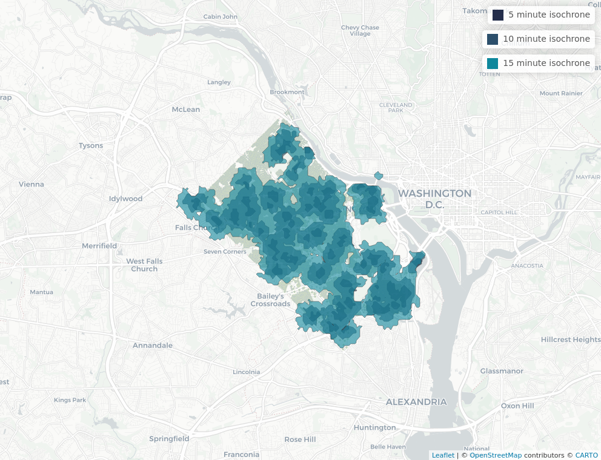

```{js echo=FALSE}

   document.getElementsByTagName('a')[0].innerHTML = ''

   document.getElementsByClassName('navbar-header')[0].style = 'margin-top:-10px;'

```

```{r setup, include=FALSE}
knitr::opts_chunk$set(echo = FALSE)
knitr::opts_chunk$set(warning = FALSE, message = FALSE) 
knitr::opts_knit$set(root.dir = rprojroot::find_rstudio_root_file())
root.dir = rprojroot::find_rstudio_root_file()

library(tidyverse)
library(sf)
library(sp)
library(mapview)
library(leaflet)
library(SpatialAcc)
library(osrm)
library(dplyr)
library(tidycensus)
library(png)
```

### Demographics Overview

```{r include=FALSE}
library(tidyverse)
library(data.table)
library(tidyverse)
library(viridis)
library(sf)
library(ggthemes)
library(RColorBrewer)
library(ggplot2)
library(leaflet)
library(sf)
library(osmdata)
library(mapview)
library(RColorBrewer)
library(readr)
library(stargazer)

acs_tract <- read_rds(paste0(root.dir, "/data/working/acs_tract.Rds"))
acs_bgrp <- read_rds(paste0(root.dir, "/data/working/acs_bgrp.Rds"))
ej = read_rds(paste0(root.dir, "/data/working/ej.Rds"))
parks <- st_read(paste0(root.dir, "/data/original/arlington_parks/Park_Polygons.shp"))

bgrp_greenspace <- read.csv(paste0(root.dir, "/data/working/bgrp_greenspace.csv"))
bgrp_greenspace$bgrp_geoid <- as.character(bgrp_greenspace$bgrp_geoid)
  
tract_greenspace <- read.csv(paste0(root.dir, "/data/working/tract_greenspace.csv"))
tract_greenspace$tract_geoid <- as.character(tract_greenspace$tract_geoid)

acs_tract <- acs_tract %>%
  merge(tract_greenspace, 
        by.x = "GEOID", 
        by.y = "tract_geoid",
        all.x = TRUE)

acs_bgrp <- acs_bgrp %>%
  merge(bgrp_greenspace, 
        by.x = "GEOID", 
        by.y = "bgrp_geoid",
        all.x = TRUE)


acs_tract <- acs_tract %>%
  st_as_sf(coords = c("long","lat")) %>%
  st_transform("+proj=longlat +datum=WGS84")

parks = parks %>%
  st_as_sf(coords = c("long","lat")) %>%
  st_transform("+proj=longlat +datum=WGS84")

bb <- getbb('arlington county, virginia')
```

#### Summary Statistics of Demographics

```{r echo=FALSE}
# "totalpop_trct"
# Summary stats tables ----------
# select variables

tract_vars <- acs_tract[, c("totalpop_trct", "black", "asian", "hispanic", "white", "other_race", "med_inc_all", "med_inc_b", "med_inc_a", "med_inc_h", "med_inc_w", "med_inc_o", "pov_all", "pov_b", "pov_a", "pov_h", "pov_w", "pov_o", "perc_under_18", "perc_ambulatory_disability", "no_vehic", "mean_greenspace", "nohealthins", "rent_ov_30")]
tract_vars = as.data.frame(tract_vars) %>% select(-geometry)

## summary statistics ##
# standard deviation

tract_sd <- tract_vars %>% 
  summarise_if(is.numeric, sd, na.rm = TRUE)
# mean
tract_mean <- tract_vars %>% 
  summarise_if(is.numeric, mean, na.rm = TRUE)
# max
tract_max <- tract_vars %>% 
  summarise_if(is.numeric, max, na.rm = TRUE)
# min
tract_min <- tract_vars %>% 
  summarise_if(is.numeric, min, na.rm = TRUE)
# median
tract_med <- tract_vars %>% 
  summarise_if(is.numeric, median, na.rm = TRUE)

# combine
tract_tab <- rbind(tract_sd, tract_mean, tract_min, tract_max, tract_med)
tract_tab <- t(tract_tab)
colnames(tract_tab) <- c("sd", "mean", "min", "max", "Median")
tract_tab = as.data.frame(tract_tab, row.names = NULL)
tract_tab$Statistics = rownames(tract_tab)
row.names(tract_tab) = NULL
tract_tab = 
  tract_tab %>% 
  #arrange(desc(mean)) %>% 
  select("Statistics",
         "Mean" = `mean`,
         "Standard Deviation" = `sd`,
         "Median",
         "Minimum" = min,
         "Maximum" = max) %>% 
  mutate(Statistics = ifelse(Statistics == "totalpop_trct", "Total Population", Statistics),
         Statistics = ifelse(Statistics == "black", "% Population: African-American", Statistics),
         Statistics = ifelse(Statistics == "hispanic", "% Population: Hispanic or Latino", Statistics),
         Statistics = ifelse(Statistics == "asian", "% Population: Asian", Statistics),
         Statistics = ifelse(Statistics == "white", "% Population: White", Statistics),
         Statistics = ifelse(Statistics == "other_race", "% Population: Other Race", Statistics),
         Statistics = ifelse(Statistics == "med_inc_all", "Median Household Income (HHI): All", Statistics),
         Statistics = ifelse(Statistics == "med_inc_w", "Median HHI: White", Statistics),
         Statistics = ifelse(Statistics == "med_inc_a", "Median HHI: Asian", Statistics),
         Statistics = ifelse(Statistics == "med_inc_b", "Median HHI: African-American", Statistics),
         Statistics = ifelse(Statistics == "med_inc_h", "Median HHI: Hispanic or Latino", Statistics),
         Statistics = ifelse(Statistics == "med_inc_o", "Median HHI: Other Race", Statistics),
         Statistics = ifelse(Statistics == "no_vehic", "% Population with No Vehicle", Statistics),
         Statistics = ifelse(Statistics == "perc_under_18", "% Population under 18", Statistics),
         Statistics = ifelse(Statistics == "mean_greenspace", "Mean number of properties<br>with greenspace", Statistics),
         Statistics = ifelse(Statistics == "pov_all", "% in Poverty: All", Statistics),
         Statistics = ifelse(Statistics == "pov_b", "% in Poverty: African-American", Statistics),
         Statistics = ifelse(Statistics == "pov_a", "% in Poverty: Asian", Statistics),
         Statistics = ifelse(Statistics == "pov_h", "% in Poverty: Hispanic or Latino", Statistics),
         Statistics = ifelse(Statistics == "pov_w", "% in Poverty: White", Statistics),
         Statistics = ifelse(Statistics == "pov_o", "% in Poverty: Other Race", Statistics),
         Statistics = ifelse(Statistics == "perc_ambulatory_disability", "% with an Ambulatory Disability", Statistics),
         Statistics = ifelse(Statistics == "nohealthins", "% Pop. with no Health Insurance", Statistics),
         Statistics = ifelse(Statistics == "rent_ov_30", "% of housing with rent > $30K", Statistics)) 


knitr::kable(tract_tab, format = "html", digits = 2, caption = "Summary Statistics of Demographic Indicators for Arlington County", align = "c")

```


#### Demographic Breakdown by Race  

```{r echo=FALSE}
## PLOTTING  - Demography: Race

leaflet(acs_tract) %>% #create leaflet object
  ## Parks Polygons (the green weird things on the map)
  addPolygons(data = parks, color = "green", group = "Parks") %>%
  addProviderTiles(provider = "CartoDB.Positron", group = "No Parks") %>%
  ## Basemaps
  addProviderTiles(provider = "CartoDB.Positron") %>%
  addProviderTiles(provider = "CartoDB.Positron", group = "Total Population") %>%
  # totalpop_trct
  addProviderTiles(provider = "CartoDB.Positron", group = "African-American Population") %>% # black
  addProviderTiles(provider = "CartoDB.Positron", group = "Asian Population") %>% # asian
  addProviderTiles(provider = "CartoDB.Positron", group = "Hispanic Population") %>% # hispanic
  addProviderTiles(provider = "CartoDB.Positron", group = "White Population") %>% # white
  addProviderTiles(provider = "CartoDB.Positron", group = "Other Race Population") %>% # other
  fitBounds(bb[1,1], bb[2,1], bb[1,2], bb[2,2]) %>% #add bounding box
  
  ## Polygons
    ## Total 
  addPolygons(data = acs_tract %>% drop_na(totalpop_trct), color = "#444444", weight = 1, smoothFactor = 0.5,
              opacity = 1.0, fillOpacity = 0.5,
              fillColor = ~colorQuantile("PuOr", totalpop_trct)(totalpop_trct),
              highlightOptions = highlightOptions(color = "white", weight = 2,
                                                  bringToFront = TRUE),
              group = "Total Population",
              label = ~paste0("The total population in ", str_replace(`NAME.y`,", Arlington County, Virginia", ""), " is ", `totalpop_trct`, "."))  %>%
  addLegend(data = acs_tract %>% drop_na(totalpop_trct), pal = colorNumeric("PuOr", acs_tract$totalpop_trct), values = ~totalpop_trct, group = "Total Population", title = "Total<br>Population", position = "topleft") %>%
  
    ## Black
  addPolygons(data = acs_tract %>% drop_na(black), color = "#444444", weight = 1, smoothFactor = 0.5,
              opacity = 1.0, fillOpacity = 0.5,
              fillColor = ~colorQuantile("PuOr", black)(black),
              highlightOptions = highlightOptions(color = "white", weight = 2,
                                                  bringToFront = TRUE),
              group = "African-American Population",
              label = ~paste0("The African-American population in ", str_replace(`NAME.y`,", Arlington County, Virginia", ""), " is ", round(`black`,2), "%."))  %>%
  addLegend(data = acs_tract %>% drop_na(black), pal = colorNumeric("PuOr", acs_tract$black), values = ~black, group = "African-American Population", title = "African-American<br>Population", position = "topleft") %>%
  
   ## Asian
  addPolygons(data = acs_tract %>% drop_na(asian), color = "#444444", weight = 1, smoothFactor = 0.5,
              opacity = 1.0, fillOpacity = 0.5,
              fillColor = ~colorQuantile("PuOr", asian)(asian),
              highlightOptions = highlightOptions(color = "white", weight = 2,
                                                  bringToFront = TRUE),
              group = "Asian Population",
              label = ~paste0("The Asian population in ", str_replace(`NAME.y`,", Arlington County, Virginia", ""), " is ", round(`asian`,2), "%."))  %>%
  addLegend(data = acs_tract %>% drop_na(asian), pal = colorNumeric("PuOr", acs_tract$asian), values = ~asian, group = "Asian Population", title = "Asian<br>Population", position = "topleft") %>%
  
    ## Hispanic
  addPolygons(data = acs_tract %>% drop_na(hispanic), color = "#444444", weight = 1, smoothFactor = 0.5,
              opacity = 1.0, fillOpacity = 0.5,
              fillColor = ~colorQuantile("PuOr", hispanic)(hispanic),
              highlightOptions = highlightOptions(color = "white", weight = 2,
                                                  bringToFront = TRUE),
              group = "Hispanic Population",
              label = ~paste0("The Hispanic population in\n", str_replace(`NAME.y`,", Arlington County, Virginia", ""), " is ", round(`hispanic`,2), "%.")) %>% 
  addLegend(data = acs_tract %>% drop_na(hispanic), pal = colorNumeric("PuOr", acs_tract$hispanic), values = ~hispanic, group = "Hispanic Population", title = "Hispanic<br>Population", position = "topleft") %>%
  
  ## White
  addPolygons(data = acs_tract %>% drop_na(white), color = "#444444", weight = 1, smoothFactor = 0.5,
              opacity = 1.0, fillOpacity = 0.5,
              fillColor = ~colorQuantile("PuOr", white)(white),
              highlightOptions = highlightOptions(color = "white", weight = 2,
                                                  bringToFront = TRUE),
              group = "White Population",
              label = ~paste0("The White population in\n", str_replace(`NAME.y`,", Arlington County, Virginia", ""), " is ", round(`white`,2), "%.")) %>% 
  addLegend(data = acs_tract %>% drop_na(white), pal = colorNumeric("PuOr", acs_tract$white), values = ~white, group = "White Population", title = "White<br>Population", position = "topleft") %>%
  
  ## Other
  addPolygons(data = acs_tract %>% drop_na(other_race), color = "#444444", weight = 1, smoothFactor = 0.5,
              opacity = 1.0, fillOpacity = 0.5,
              fillColor = ~colorQuantile("PuOr", other_race)(other_race),
              highlightOptions = highlightOptions(color = "white", weight = 2,
                                                  bringToFront = TRUE),
              group = "Other Race Population",
              label = ~paste0("The other race population in\n", str_replace(`NAME.y`,", Arlington County, Virginia", ""), " is ", round(`other_race`,2), "%.")) %>% 
  addLegend(data = acs_tract %>% drop_na(other_race), pal = colorNumeric("PuOr", acs_tract$other_race), values = ~other_race, group = "Other Race Population", title = "Other Race<br>Population", position = "topleft") %>%
  
   
  
  # Layers control
  addLayersControl(
    overlayGroups = c("Total Population", "African-American Population", "Asian Population", "Hispanic Population", "White Population", "Other Race Population"),
    baseGroups = c("Parks", "No Parks"),
    options = layersControlOptions(collapsed = FALSE)) %>% 
  hideGroup("African-American Population") %>% 
  hideGroup("Asian Population") %>% 
  hideGroup("Hispanic Population") %>% 
  hideGroup("White Population") %>% 
  hideGroup("Other Race Population")
```


### Park Access
```{r}
colors <- c("#232d4b","#2c4f6b","#0e879c","#60999a","#d1e0bf","#d9e12b","#e6ce3a","#e6a01d","#e57200","#fdfdfd")

#residential <- read_sf("/home/mes5bu/git/mc/data/working/corelogic/residential.csv")
residential <- read_sf(paste0(root.dir, "/data/working/corelogic/residential.csv"))
residential_sf <- st_as_sf(residential, coords = c("parcel_level_longitude", "parcel_level_latitude"))
st_crs(residential_sf) <- "+proj=longlat +datum=WGS84"
residential = mapview(st_geometry(residential_sf), cex =.5, layer.name = "residential areas", color = colors[5])
```


#### Circle Radius Methods

When we use 1/2 mile radius circles as proxies for access 99.65 percent of residences are covered with park access. This is incredibly high. However, this doesn't take into account park quality, amenities, or acreage.

```{r circles}
circle_park_iso <- read_rds(paste0(root.dir, "/data/working/circle_park_isochrone.Rds"))
circle_park_iso <- st_as_sf(circle_park_iso)
st_crs(circle_park_iso) <- "+proj=longlat +datum=WGS84"
#circle_table <- read.csv(file = "/home/mes5bu/git/mc/data/working/circle_park_iso_table.csv")
circle_table <- read.csv(paste0(root.dir, "/data/working/circle_park_iso_table.csv"))
knitr::kable(circle_table)
```

```{r circle map}
m1 = mapview(st_geometry(circle_park_iso), layer.name = "1/2 mile circle", col.regions = colors[1])
circle_map = m1 + residential
circle_map
```

#### Traveltime Isochrone Method

To get an idea of park access, we computed coverage as the percentage of total residences that are covered within time-based isochrones from the centroid of each park. We did this for walking, driving, and public transportation. Here we feature the walking map. 


##### Walking

When we create access polygons as 5-, 10-, and 15-minute polygons of walking, 32 percent, 85, ad 99 percent of residences are covered respectively. Within a short walk this isn't very high coverage, but within 10 minutes this is high coverage.

```{r walking}
#table <- read.csv(file = "/home/mes5bu/git/mc/data/working/park_iso_table.csv")
table <- read.csv(paste0(root.dir, "/data/working/park_iso_table.csv"))
knitr::kable(table)
```

{style="width:60%"}


### Amenity Access

To measure park access we also care about measuring access to good parks. To measure park goodness we use amenities as a proxy variable. The following maps and tables measure individual's access to different types of amenities. We did this for tennis courts, basketball courts, playgrounds, and parking. We will highlight playgrounds below. 


##### Playgrounds

So similarly to what we saw above, we now evaluate access in terms of the percent of total residences in the county that have access to the playground amenity within a 5-, 10-, or 15-minute isochrone via walking, public transportation, or driving.

##### Walking

```{r playground}
table <- read.csv(paste0(root.dir, "/data/working/traveltime_isochrones/park_iso_playground.csv"))
knitr::kable(table)
```
{style="width:60%"}


##### Public Transportation

```{r pt playground}
table <- read.csv(paste0(root.dir, "/data/working/traveltime_isochrones/park_iso_pt_playground.csv"))
knitr::kable(table)
```
{style="width:60%"}


##### Driving
```{r playground drv}
table <- read.csv(paste0(root.dir, "/data/working/amenities_web/park_iso_drv_playground.csv"))
knitr::kable(table)
```
{style="width:60%"}


### Two-Step Floating Catchment Area Scores

In addition, we investigated how park accessibility varies across Census tracts within racial groups. We used the two-step floating catchment area method to calculate spatial accessibility scores for Census tracts in Arlington County by race. These scores give a measure of accessibility for each tract to the parks and their amenities in Arlington County and are calculated as the summation of the supply to demand ratio for each park contained in the catchment area of the Census tract. The supply of a park is defined by its acreage and its demand is defined by the total population count of a racial group in a Census tract. The catchment areas for both the parks as well as Census tracts are defined by a distance of one mile. Census tracts with higher scores are considered to have more accesibility to parks and their amenities.

#### All Park Acreage 

Here, we consider every park in Arlington County when calculating the accessibility of the Census tracts. We can see that the West to Southwest area of Arlington County has the highest level of accessibility. We observed that for the Black, Asian, and Other populations, however, there are high levels of accessibility in the Northern region. This is due to the fact that those areas have a number of large acreage parks combined with the low numbers of people who identify as Black, Asian, or Other.  


```{r, include=FALSE}
library(sf)
library(SpatialAcc)
library(osrm)
library(dplyr)
library(tidycensus)
library(mapview)

# read in ACS data
#Sys.getenv("CENSUS_API_KEY")

acs_vars <- c(  
  # total population
  "B01003_001",
  # Hispanic ethnicity
  "B03001_003", "B03001_001",
  # White
  "B02001_002", "B02001_001",
  # Black
  "B02001_003",
  # Asian
  "B02001_005",
  # Other
  "B02001_004", "B02001_006", "B02001_007",
  "B02001_008", "B02001_009", "B02001_010"
  )

data_tract <- get_acs(geography = "tract", 
                      state = 51, 
                      county = 013,
                      variables = acs_vars,
                      year = 2019, 
                      survey = "acs5",
                      cache_table = TRUE, 
                      output = "wide", 
                      geometry = TRUE,
                      keep_geo_vars = TRUE)

acs_tract <- data_tract %>%
  transmute(STATEFP = STATEFP,
            COUNTYFP = COUNTYFP,
            TRACTCE = TRACTCE,
            GEOID = GEOID,
            NAME.x = NAME.x,
            NAME.y = NAME.y,
            ALAND = ALAND,
            AWATER = AWATER,
            total_pop = B01003_001E,
            hispanic = B03001_003E,
            white = B02001_002E,
            black = B02001_003E,
            asian = B02001_005E,
            other_race = B02001_004E + B02001_006E + B02001_007E + B02001_008E + B02001_009E + B02001_010E
            )

acs_tract$total_pop[acs_tract$total_pop == 0] <- 1
acs_tract$hispanic[acs_tract$hispanic == 0] <- 1
acs_tract$white[acs_tract$white == 0] <- 1
acs_tract$black[acs_tract$black == 0] <- 1
acs_tract$asian[acs_tract$asian == 0] <- 1
acs_tract$other[acs_tract$other == 0] <- 1


## park data
# transform to utm with meter units
parks <- st_read(paste0(root.dir, "/data/original/arlington_parks/Park_Polygons.shp")) %>%
  filter(Ownership == "Arlington County Park")

# amenities
parks_amenities <- read.csv(paste0(root.dir, "/data/working/parks_amenities.csv"))

tract_dist_mat <- read.csv(paste0(root.dir, "/data/working/park_to_tract_dist_mat.csv"))

bgrp_dist_mat <- read.csv(paste0(root.dir, "/data/working/park_to_bgrp_dist_mat.csv"))
```

```{r tract}
white_tract_tsfca <- ac(p = acs_tract$white, 
                        n = parks$Acreage, 
                        D = tract_dist_mat, 
                        d0 = 1609, 
                        family = "2SFCA")

acs_tract$white_tract_tsfca <- white_tract_tsfca

black_tract_tsfca <- ac(p = acs_tract$black, 
                        n = parks$Acreage, 
                        D = tract_dist_mat, 
                        d0 = 1609, 
                        family = "2SFCA")

acs_tract$black_tract_tsfca <- black_tract_tsfca

asian_tract_tsfca <- ac(p = acs_tract$asian, 
                        n = parks$Acreage, 
                        D = tract_dist_mat, 
                        d0 = 1609, 
                        family = "2SFCA")

acs_tract$asian_tract_tsfca <- asian_tract_tsfca

other_tract_tsfca <- ac(p = acs_tract$other, 
                        n = parks$Acreage, 
                        D = tract_dist_mat, 
                        d0 = 1609, 
                        family = "2SFCA")

acs_tract$other_tract_tsfca <- other_tract_tsfca
```


#### White

```{r tract_plots_white}
# white
mapview(st_geometry(parks), 
        cex =.5, 
        layer.name = "Parks in Arlington County", 
        col.region = "gray",
        color = "gray") + 
  mapview(acs_tract, 
          zcol = "white_tract_tsfca", 
          layer.name = "TSFCA",  
          col.regions = sf.colors(alpha = 0.1))
```


#### Black

```{r tract_plots_black}
# black
mapview(st_geometry(parks), 
        cex =.5, 
        layer.name = "Parks in Arlington County", 
        col.region = "gray",
        color = "gray") + 
  mapview(acs_tract, 
          zcol = "black_tract_tsfca", 
          layer.name = "TSFCA",  
          col.regions = sf.colors(alpha = 0.1))
```


#### Asian

```{r tract_plots_asian}
# asian
mapview(st_geometry(parks), 
        cex =.5, 
        layer.name = "Parks in Arlington County", 
        col.region = "gray",
        color = "gray") + 
  mapview(acs_tract, 
          zcol = "asian_tract_tsfca", 
          layer.name = "TSFCA",  
          col.regions = sf.colors(alpha = 0.1))
```


#### Other

```{r tract_plots_other}
# other
mapview(st_geometry(parks), 
        cex =.5, 
        layer.name = "Parks in Arlington County", 
        col.region = "gray",
        color = "gray") + 
  mapview(acs_tract, 
          zcol = "other_tract_tsfca", 
          layer.name = "TSFCA",  
          col.regions = sf.colors(alpha = 0.1))
```
