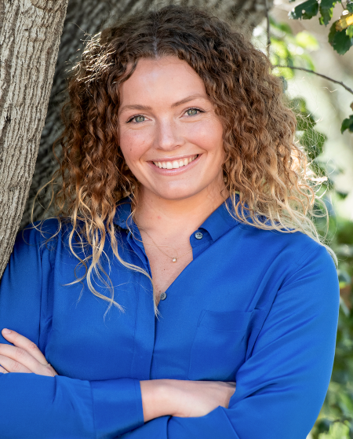

---
title:
output: 
  html_document:
    theme: cerulean
---
```{js echo=FALSE}

   document.getElementsByTagName('a')[0].innerHTML = ''

   document.getElementsByClassName('navbar-header')[0].style = 'margin-top:-10px;'

```

```{r setup, include=FALSE}
knitr::opts_chunk$set(echo = TRUE)
```

```{css, echo = FALSE}
{
  box-sizing: border-box;
}
.column {
  float: left;
  width: 25%;
}
.row:after {
  content: "";
  display: table;
  clear: both;
}
.justify {
  text-align: justify
}
```

### DSPG Team Members {style=text-align:center}

<div class="row">
<div class="column">
{style="width:60%; display: block; margin-left: auto; margin-right: auto;"} 

[Morgan Stockham](https://www.morganstockham.com), Fellow  

Claremont Graduate University

Applied Microeconomics
</div>

<div class="column">
{style="width:60%; display: block; margin-left: auto; margin-right: auto;"} 

[Digvijay Ghotane](https://github.com/diggyg97), Fellow 

Georgetown University     

Public Policy
</div>

<div class="column">
{style="width:60%; display: block; margin-left: auto; margin-right: auto;"} 

[Asia Porter](https://github.com/asiaporter), Intern  

Washington University in St. Louis  

Sociology, Legal Studies
</div>

<div class="column">
{style="width:60%; display: block; margin-left: auto; margin-right: auto;"} 

[Madeline Garrett](https://github.com/madelinegarrett), Intern  

University of Colorado - Boulder

Statistics and Data Science, Political Science
</div>


### UVA SDAD Team Members {style=text-align:center}

<div class="row">
<div class="column">
{style="width:60%; display: block; margin-left: auto; margin-right: auto;"} 

[Eric Oh](https://biocomplexity.virginia.edu/person/eric-oh) 

Research Assistant Professor

</div>

<div class="column">
{style="width:60%; display: block; margin-left: auto; margin-right: auto;"} 

[Kathryn Linehan](https://biocomplexity.virginia.edu/person/kathryn-linehan)

Research Scientist   

</div>

<div class="column">
{style="width:60%; display: block; margin-left: auto; margin-right: auto;"} 

[Aaron Schroeder](https://biocomplexity.virginia.edu/person/aaron-schroeder) 

Research Associate Professor

</div>
### Project Sponsors/Stakeholders {style=text-align:center}

Jaime Lees, Chief Data Officer, Arlington County Government