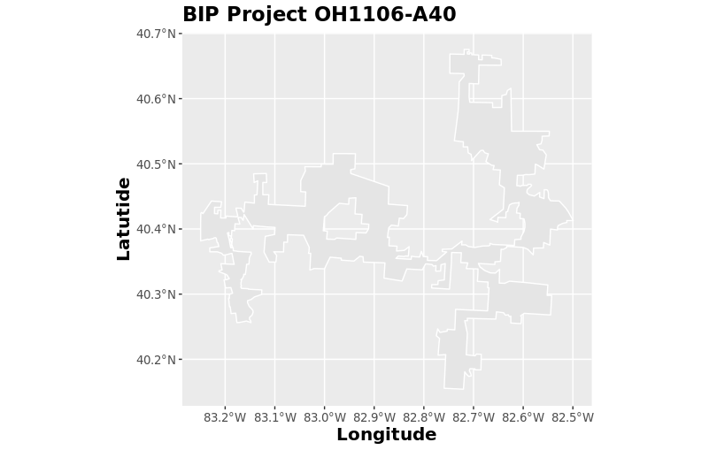
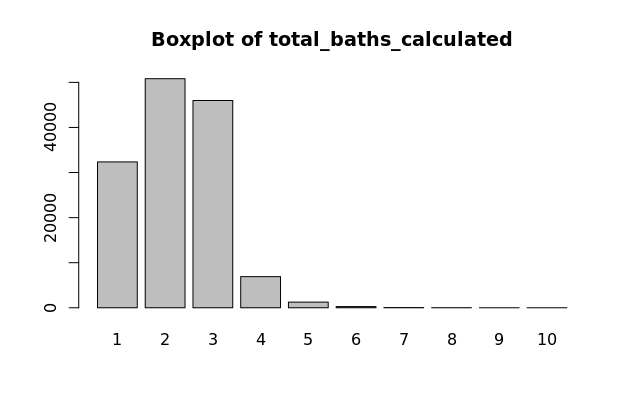
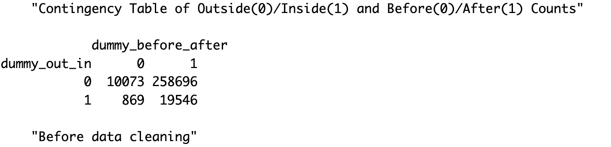

<font size="3">


# Literature Review
We conducted a literature review of journals that analyzed the effects of high-speed internet access and property prices.\ 

### Home Is Where the Internet Is? High-speed Internet’s Impact on Rural Housing Values\ 
##### Kelsey L. Conley and Brian E. Whitacre\ 
This report uses data from the National Broadband Map, the Federal Communications Commission, and over 2,700 housing transactions from June 2011 to June 2017 to examine the impact of broadband availability on housing values in two rural Oklahoma counties via a hedonic price model. The results find no support for the existence of a broadband premium, and stress that differences across counties are crucial in assessing rural housing prices. The full report can be found at [this link](https://doi.org/10.1177/0160017620918652).\ 

### High-speed Internet access and housing values
##### Gabor Molnar, Scott J. Savage, and Douglas C. Sicker
This report uses a hedonic regression model that relates house values to high-speed Internet access while controlling for the potential endogeneity of Internet access. Results show that single-family homes with access to a 25 Mbps broadband connection have a price that is about \$5,977, or 3%, more than similar homes in neighborhoods with 1 Mbps. The rural premium is lower at \$5,099. The full report can be found at [this link](https://doi.org/10.1080/00036846.2019.1631443).

# Project Area Selection
For this analysis, we used a subset of the CoreLogic data, which included data for the eight states with the highest number of properties in the data: Arkansas, California, Colorado, Florida, Georgia, North Carolina, Ohio, and Texas. To select the project area for our analysis, we calculated the counts of properties inside the project area and outside the project area by a radius of 20 miles, both before and after the broadband deployment project was implemented. This was completed by correlating the latitude/longitude of each property to the project shapefiles and finding the properties that intersected using the sf package in R. The counts are presented in the table below for a subset of the 132 BIP projects that were present in one of the eight states in the CoreLogic data.

---
Counts of Properties In/Out Project Area and Before/After Project Implementation
---

```{r,results='asis'}
state8_counts <- read.csv("www/state8_counts")
knitr::kable(state8_counts)
```
Broadband Initiative Project OH1106-A40 is one of the few project areas that has sufficient data from this specific CoreLogic dataset, so our analysis will be based upon the properties and their prices and characteristics within this project area. The OH1106-A40 project shapefile and plot of properties inside (green) and outside (orange) are presented below. 

{width=60%}</left> {width=60%}</right> 

# Model

### Variable Selection

#### Dependent Variable: Sales Price vs Assessed Price
Our initial analysis was focused on assessing changes in property prices using the sale value as the dependent variable. However, the sales values data are largely incomplete with a completeness percentage of 65.90% as shown by the exploratory data analysis in the Data page. We shifted our dependent variable from sale value to the assessed values of the properties. The assessed values are calculated by county-level tax offices that conduct these assessments on a regular basis, varying by tax office. The assessed values had a completeness percentage of 99.41%, ensuring that our analysis could use most of the data.
<br>
<br>
To establish that assessed values could serve as a good proxy for sales values within Ohio, we calculated the correlation between the medians and means of the two variables at the ZIP code level by year. We removed ZIP codes that had less than 40 observations within a given year. The correlation between the median and mean values was both strong and positive, with a correlation coefficient of 0.938 and 0.961, respectively. We plotted these points and overlayed them with a LOESS (locally weighted smoothing) regression shown below. We can confidently use assessed prices as the dependent variable of our analysis.

{width=40%}</left> {width=40%}</right>

#### Independent Variable Manipulation
##### Age (age)
CoreLogic provides the year built and effective year built of properties, where the year built represents the initial property building year, and the effective year represents year where substantial renovation was completed to the property. Thus, we created a new variable that represented the most recent year built, i.e., if the property had an effective year built, then this value was used; otherwise, the initial year built was used. We then subtracted this value from the assessed year, which would give us the age of the property when the home was assessed. For example, if the home was assessed in 2009, and the home was renovated in 1993, the age of the home would be 16 years at the time of assessment. This age variable is used in our model.

##### Distance (distance_miles)
The distance is a main effect variable which calculates the distance of the property to the closest border of the project area, which was calculated using the shapefiles. Properties inside of the project areas have a negative distance while properties outside have a positive distance. This will be used to assess whether the program had an effect on property prices before/after the project was implemented. This distance_miles variable is used in our model. 

##### Living Area to Land ratio (sqft_ratio, living_square_feet, land_square_footage) 
The ratio of the living area (square feet) to the land area (square feet) was taken to create the variable sqft_ratio. sqft_ratio, living_square_feet and  land_square_footage are all used in our model.

#### Dummy Variables
##### Inside/Outside Project Area (dummy_out_in)
To specify whether a property is inside or outside of the project area, we created dummy variable dummy_out_in where 0 represents a property outside of the project area and 1 represents a property inside the project area. This was created using the project area shapefiles. 

##### Before/After Project Implementation (dummy_before_after)
To specify whether a property's value was before or after the project was implemented, we created dummy variable dummy_before_after where 0 represents an assessment before project implementation and 1 represents an assessment after project implementation. The OH1106-A40 project was implemented in 2010, so assessment values leading up to and including 2010 correspond to a 0 and assessment values after 2010 correspond to a 1.

##### Mobile Home and Fireplace (dummy_mobile_home_ind, dummy_fire_place)
The CoreLogic data has indicators for whether a property is a mobile home or has a fireplace. Thus, we create dummy variable where 1 represents that it is a mobile home or has a fireplace, and 0 if it is not a mobile home or doesn't include a fireplace. Variables dummy_mobile_home_ind and dummy_fire_place are included in our model.

#### Factor Variables (factor_bedrooms, factor_total_baths_calculated, factor_number_of_units, factor_stories_number)
CoreLogic data includes values for the number of bedrooms, bathrooms, units, and stories that each property has. These are all discrete variables and have varying distributions as seen on the boxplots to the left. These are all transformed to factor variables with fewer levels. The factor variable distributions should have near normal distributions, which is true for these variables, not including the number of stories. Variables factor_bedrooms, factor_total_baths_calculated, factor_number_of_units, and factor_stories_number are all used in our model. 

{width=45%}</left>  {width=45%}</right>
{width=45%}</left>  {width=45%}</right>
{width=45%}</left>  {width=45%}</right>
{width=45%}</left>  {width=45%}</right>

#### Interactions (dummy_in_after_interaction, distance_after_interaction, distance_in_after_interaction.)
Finally, we create three interactions between variables. The first interaction variable is dummy_in_after_interaction, an interaction between dummy_out_in and dummy_before_after. Thus, the observations will be valued at 1 if they are both inside the project area and after the project implementation. This variable is the main effect variable, and we will use the coefficient and p-value of this variable to determine the impact of the broadband initiative project.
<br>
<br>
The next interaction variables are distance_after_interaction and distance_in_after_interaction. Interaction variable distance_in_after_interaction represents an interaction between the distance_miles and dummy_out_in and dummy_before_after. Thus, in a similar fashion to dummy_in_after_interaction, distance_in_after_interaction represents the effect on property prices for properties inside and after project implementation, magnified by the distance of the property to the project boundary. This variable is also the main effect variable, and we will use the coefficient and p-value of this variable to determine the impact of the broadband initiative project, although in a seperate model from the dummy_in_after_interaction variable.

#### Data Cleaning
After selecting and manipulating the variables, duplicated and incomplete property observations were deleted. Our final dataset had 137558 observations, compared to 289184 before the data was cleaned. The distribution of these properties by inside/outside the project area and before/after project implementation are shown in the contingency matrices below.

{width=80%}</center> 
{width=90%}</center> 

### Final Model
With the variables mentioned above, we created two log-linear models with the dependent variable of assessed property values. The model to the left uses main effect variables dummy_out_in, dummy_before_after, and dummy_in_after_interaction. The main variable coefficient to consider is the dummy_in_after_interaction coefficient of -0.01409, which is 0.986 when exponentiated. This signals that homes inside the project area after the project implemention had a lower property value by 1.4%. However, this is the only variable in the model with an insignificant p-value, denoting that no significant conclusion can be made.
<br> <br>
The model on the right uses dummy_before_after, distance_miles, distance_after_interaction, and distance_in_after_interaction. The main variable coefficient to consider is the distance_in_after_interaction coefficient of -1.17e-05, which is 0.999 when exponentiated. This denotes that home that were inside the project area and after project implementation had a lower property value by 0.1%, showing almost no effect. Unlike the first model, this main effect variable is significant to the model. 
<br> <br>
In both models, housing characteristics have strong influences on the property homes. Properties with fireplaces and higher numbers of bedrooms, bathrooms, units, stories, living area, and land area had a housing premium. On the other hand, properties that were older, classified as mobile homes, and had a higher living area to land area ratio had lower property values. 
<br> <br>
The outputs are given below.

{width=45%}</left> {width=45%}</right> 

### Conclusion
This project sought to determine if the implementation of broadband in rural areas would affect the property values of homes in said areas. Our analysis focused specifically on Broadband Initiative Project OH1106-A40. From the two models above, we can infer that there was no significant difference between the property values of homes that were inside of the project area versus outside of the project area after the project was implemented. Housing characteristics such as age, size, and the number of bedrooms/bathrooms in the property were significant indicators of the property value. 

### Next Steps
This analysis revolved around a specific project area, which we would like to use as a model to extrapolate to other project areas in the Broaband Initiative Project and other broaband projects more generally. We would also like to implement further modeling techniques such as the spatial regression model and difference in differences model mentioned in the overview page. 

