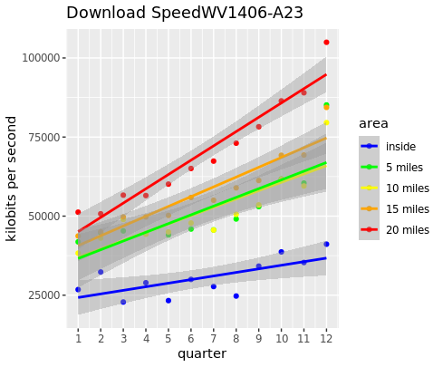

# Exploratory Data Analysis
In order to determine which project area we would analyze, we looked at the number of Ookla observations for some of the most populous project areas funded in 2017, and used the region with the most consistently high counts of Ookla tests in order to ensure we had a sample size large enough to proceed. The reason we chose 2017 as the year of funding was to increase the probability that the project was in the process of being implemented between the years over which Ookla data was collected.
 
{width=45%}
  
{width=45%}
  
{width=45%}
  
 

# Variable Selection and Methods
Three linear models were created; one for each of download speeds, upload speeds, and latency periods. For each, we looked at the log of the value in order to correct for right-skewed data. In addition to time, the proportion of the Ookla tile in the project area, and the interaction between the two, we also included various tract level demographic data which had the potential to influence internet speeds in the area, such as median income. 
 
All tract level data was pulled from the American Community Survey for the year 2015 to ensure the data were collected before the infrastructure grant had the opportunity to affect such demographics. After potential variables of interest were identified, a step function utilizing AIC was implemented to bring out only the most significant variables. 

# Models
We modeled the effects of the program using a linear regression model where the effects of the program were captured by a variable equal to fixed effects for each year multiplied by an indicator for the presence within the project area. After selecting a set of variables we believed could play a role in internet speeds in an area, we ran our model through a step function designed to select only those variables which were most significant.

## Model for Download Speeds
We measured the natural log of the average download speed in kilobits per second.
 
{width=50%}

 

## Model for Upload Speeds
We measured the natural log of the average upload speed in kilobits per second.
 
{width=50%}

 

## Model For Latency
We measured the natural log of the average latency in milliseconds.
 
{width=50%}
 

## Conclusion
Overall, it seems that our model attributes most of the variation in internet quality to tract level demographic data. For example, the minority population and number of renters in an area were highly indicative of internet quality. This may be due to the fact that both of these variables tend to be higher in urban areas, where it is more profitable for companies to invest in improving internet. In each model, internet speed was also shown to improve over time and to have been of higher quality outside the project area in general. These findings are consistent with the assumptions that internet would improve as technology advances and that this region is likely only receiving a grant due to its initially poor internet quality. 

However, for each of the three metrics Ookla employs to measure internet quality, the typical measures of statistical significance recognized the effect of the program as an insignificant factor in determining the overall value of metric. In fact, in the latency model, the step function removed this variable altogether due to its lack of significance. This apparent lack of program effectiveness may be due to the program being incomplete as of the time of data collection. 

## Next Steps
Nonetheless, we hope to be able to apply this methodology to other project areas with the larger goal of measuring the nationwide impact of these programs. If we were to implement this model again, we would start with a project which received funding at an earlier date. This selection would allow us to be more certain construction on the project was actually proceeding as Ookla data was collected. Additionally, going forward we would hope to implement spatial regression techniques to ensure that we are giving more weight to comparisons between Ookla tiles which are nearby each other.

