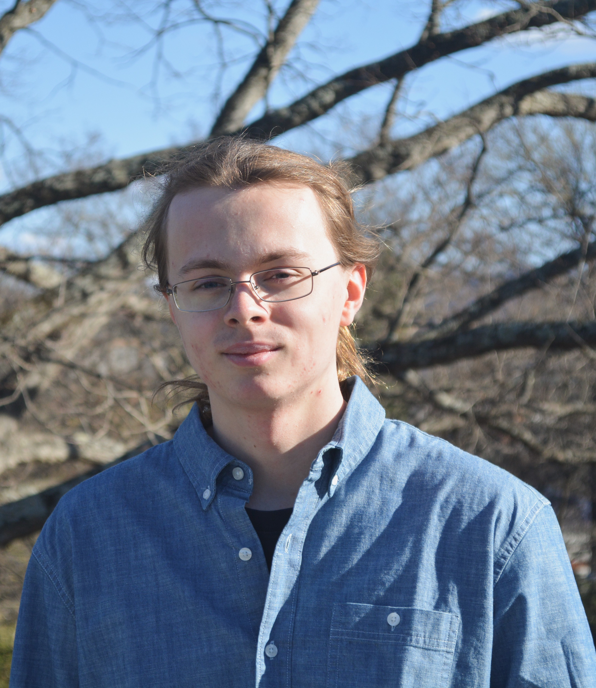

# Interns
{width=40% }
    

## *Kristian Olsson*
Data Science for the Public Good Intern
 
Kristian is a rising third year at the University of Virginia pursuing majors in Mathematics and Statistics.

{width=40% }
    
## *Donovan Cates*
Data Science for the Public Good Intern
 
Donovan is a rising fourth year at the University of Virginia pursuing majors in Mathematics and Economics.

# Faculty and Staff

{width=40% }
    

## *Aritra Halder*
Research Assistant Professor
 

{width=40% }
    

## *Joshua Goldstein*
Research Assistant Professor
 

{width=40% }
    

## *Hanna Charankevich*
Postdoctoral Research Associate
 

{width=40% }
    

## *Neil Kattampallil*
Research Scientist
 