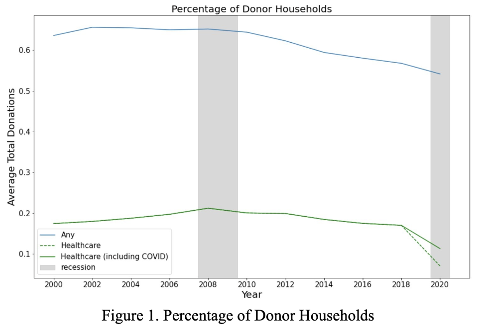

To observe altruistic trends, we investigated the biennial donation data and demographics from PSID, a biennial survey of American households since 1968. 
 
It is a comprehensive survey which includes important attributes such as income, wealth, family compositions, and residence. The philanthropy module was introduced in 2001 and collects data on donations to different types of non-profits. This study focuses on the data between 2001-2019. On average, there is data for 8640 households each year. The dependent variables that this study focuses on are whether the household donated to healthcare organizations and what amount they donated to those organizations is. It is worth noting that the PSID data only recorded donations over $25. Besides, predictors such as income, wealth, and self-reported health are considered in this study as well. 

{width=60% }

Figure 1 above reveals the percentage of donor households over the years from 2000 to 2020. The blue line represents the percentage of all causes of donations, while the green lines represent the percentage of donations to healthcare nonprofits only. The difference between the green solid line and the dashed line represents the donations that include specific COVID-19 related items. Tracing the lines through the years, we can see that there is a decreasing trend regarding the percentage of households donating money. The percentage of households who donated dropped from around 61 percent to 58 percent over the years, while the percentage of households who specifically donated to healthcare dropped from around 17 percent to 12 percent over the time.

{width=60% }

Figure 2 above demonstrates the trend of the average donations among those donor households over time. The blue line represents specifically donor households, and the yellow line represents all households. It is worth noting that there is an extreme value in the year 2000 (shown as the dash line), and the adjusted version for this extreme value is shown as the solid line. Based on this graph, we can observe that the average amount for both total donations and healthcare donations are increasing throughout the years.  

Combining the findings from the two graphs above, it is interesting to point out that although the percentage of households donating is decreasing, the average donation amount is increasing among those households who are donating.  

 
