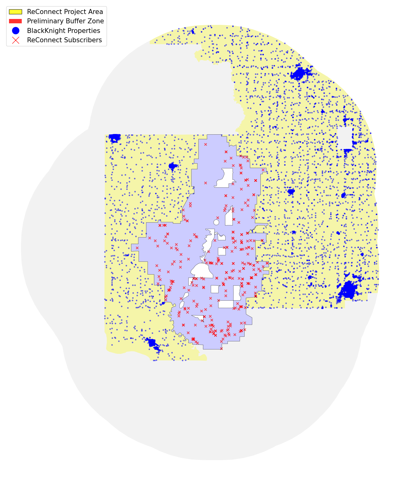

# Rural Buffer Zone

Moreover, since the project area is located in a rural area, we need to ensure that we compare their improvement in internet connectivity to communities of similar rurality conditions as well. Thus, while taking the project subscribers as our treatment group, we incorporate two measures to pick a matching control group.

To ensure enough similarity between the control group and the treatment group, we define a buffer zone as any area within 20 miles of the project area. Then we overlay it with the census tract map and filtered out the tracts that have a [Rural-Urban Commuting Area (RUCA)](https://www.ers.usda.gov/data-products/rural-urban-commuting-area-codes/) code below 7, i.e., we will only keep the tracts in the buffer zone that are either a small town or completely rural.

# Matching Sample

As previously explained, we want to ensure the inclusion of property characteristics to avoid biases that can arise from the confounded correlation between household features and access to internet connection. Thus, we use street address matching to link the subscribers with their information in the BlackKnight dataset. To maximize credibility, we dropped all those that we cannot gain property information for.

Note that in this particular project, a state border lies in the middle of the project area. Though we can match some of the subscribers in the upper state to records in the BlackKnight dataset, we are lacking any information on property characteristics on all these properties in the BlackKnight data set. Thus, they are removed from the treatment group, and one of our next steps is to use web scraping to try looking for these missing entries.

Then, the remaining 189 subscribers are used as our treatment group. We want to select a control group of the same size and similar characteristics from the rural buffer zone. By treating their property characteristics as vectors, we can choose the matched counterpart for each subscriber in the control group that minimizes the [Mahalanobis distance](https://en.wikipedia.org/wiki/Mahalanobis_distance). We did so through the R package [*Matching*](https://cran.r-project.org/web/packages/Matching/index.html). The included household characteristics are

* number of bedrooms
* number of bathrooms
* building area (squared footage)
* age of building
* assessed value in 2021.

We plot the matched sample below, together with the fitted Ookla data (see Analysis Ookla Kernel tab).

