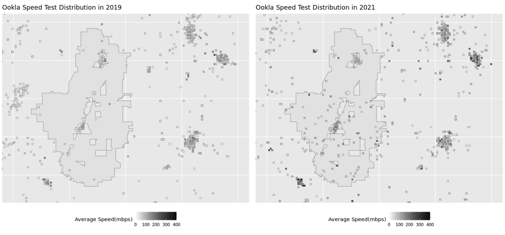

# Ookla data overview

[Ookla](https://www.speedtest.net/) provides world-wide internet speed testing services, and record the geographic location and date of each speed test performed. For privacy concerns, we only accessed the aggregated data, in the form of the average download speed by all tests performed within a 600-by-600-meter tile. A visualized example is included below.

Since the ReConnect project aims to serve rural communities, and rural areas tend to have low population density, our speed testing data record in the areas of interest are sparse. Thus, many properties we selected do not fall exactly in a tile with Ookla data. We thus need to estimate the distribution of internet speed, based on these discrete tiles.

# Kernel Smoothing

A [kernel](https://en.wikipedia.org/wiki/Kernel_(statistics)) function is a function of distance from the point to be estimated and the existing data points. For each property whose Ookla test speed needs to be estimated, we can use the kernel function to generate weights for each Ookla data point, and the estimated value will be the weighted mean of all entries in the Ookla dataset. With a Gaussian kernel, as a data point becomes farther, its weight decreases exponentially. 

We implemented a Gaussian kernel on the properties in the sample project and its surrounding buffer zone with the 2019 and 2021 Ookla data. We plot the results below.
For each tile, denote the distance between the $i$th tile and the property as $D_i$. The weight of the $i$th tile, $W_i$, is calculated as $W_i = e^{-\frac{D_i}{\phi}}$.
The imputed Ookla speed for a specific property is then calculated as

$$
ImputedSpeed = \frac{\sum W_i * Devices * TileSpeed_i}{\sum W_i}
$$

# Cross Validation

In the Gaussian kernel function, there is a parameter that needs to be tuned, which is $\phi$. This is analoguous to the $\sigma$ in a normal distribution function. To choose the best value of this parameter for the kernel smoothing function, we ran a 5-fold cross validation on the Ookla dataset in 2021. We randomly divided the dataset into five subsets. Each subset was used as a validation set while the rest four were combined into a training set. We chose the parameter that minimized the average Root Mean Squared Error(RMSE). In the graph above, we fitted the kernel with $\phi$ being 1,000 meters.
