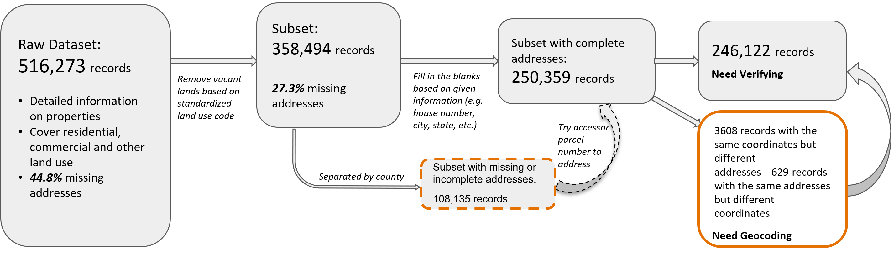
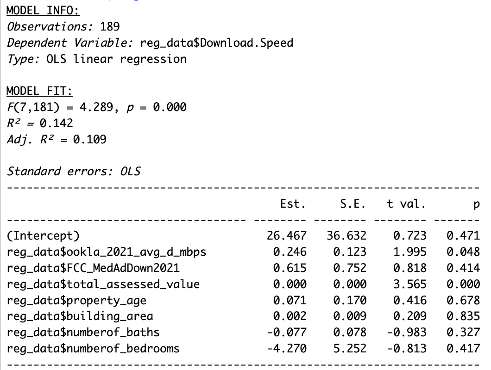

```{css, echo=FALSE}
/* this chunk of code centers all of the headings */
h1, h2, h3, h4, h5 {
  text-align: center;
}
```

<br>
<br>
<br>

# Impact of Rural Broadband Development Programs
## Assessing the USDA ReConnect Program
<br>
<br>
<br>
<br>

## Data Science for the Public Good Intern
### Steve Zhou <br> Annie Xie

<br>
<br>

## Social and Decision Analytics Division, University of Virginia
### Josh Goldstein <br> Neil Kattampalil <br> Leonel Siwe

<br>
<br>
<br>

## Sponsored by:
### John Pender <br> Economic Research Service - U.S. Department of Agriculture

<br>
<br>
<br>
<br>
<br>
<br>
<br>
<br>

<center>

</center>
<br>

## The USDA ReConnect Program
### - Three rounds of funding completed, with the fourth on-going
### - 316 projects approved and $3.86 billion invested since 2019

<br>
<br>

## Three primary goals of 2023 DSPG Summer Project: 

### 1. Improve dataset quality at household level through geocoding and web scraping
### 2. Assess the impact of a completed ReConnect project on internet connection
### 3. Create a workflow that can be scaled nationally and reproduced for future projects

<br>
<br>
<br>
<br>
<br>
<br>
<br>
<br>

# Methodology: Difference-in-Difference
#### Compare the internet speed of subscribers inside the project area (the treatment group) and comparable households around the project area (the control group) before and after project completion
<br>

## (1) Challenge in matching treatment and control households
### Solution: BlackKnight property dataset
## (2) Challenge in determining internet speed
### Solution: build a predictive model based on subscription data in 2021
<br>
<br>
<br>
<br>


# Summary of datasets 

|    Dataset  |      Level        |      Key Contents       | Year |
|------------:|:-----------------:|:--------------------------:|:---------------:|
| BlackKnight Property Data |  Household level  | Housing characteristics (e.g. number of bedrooms), address, coordinates |  2021 |
| ReConnect Subscription Data | Household level | Subscription speed, address, coordinates |  2021 | 
| Ookla Speed Test Data |    620m by 620m tiles     |    Average speed and number of tests within each tile, geometry of tiles     |    2019 - 2022 | 
| Federal Commission of Communication (FCC) Broadband Data |        Census block level       |   Broadband providers, maximum advertised speed for each provider within each census block     |    2019 - 2021 |

<br>
<br>
<br>
<br>
<br>
<br>
<br>
<br>
<br>

# Geocoding Schema

## Coordinates and addresses are key to linking different datasets and predicting internet speed

<center>

</center>

<br>
<br>

# We experimented and evaluated three geocoding APIs

|        API |        Bing       |       Census       | OpenStreetMap |
|-----------:|:-----------------:|:------------------:|:-------------:|
|      Limit |    50,000 / day   |   10,000 / batch   |   1 / second  |
|      Speed | 0.2-0.25s / query | 0.01-0.02s / query |   1s / query  |
| Match rate |        98%        |         85%        |      73%      |
|  Avg. Diff |        26m        |         94m        |      229m     |

<br>
<br>
<br>
<br>
<br>
<br>
<br>
<br>
<br>
<br>
<br>
<br>
<br>

# Ookla Imputation
<br>
<center>

</center>
<br>

### Ookla provides data as the average speed testing result in a 600-by-600 meter tile.
### We applied a Gaussian kernel to impute speed at each propery based on their lat-long.

<br>
<br>
<br>
<br>
<br>
<br>
<br>
<br>
<br>
<br>

# A predictive model is estimated using the 2021 data of the ReConnect subscribers
$$
SubscriptionSpeed = \beta_0 + \beta_1ImputedOokla + \beta_2FCCMedAdSpeed + \vec{\beta_i}\vec{HousingFeatures} + e
$$
<br>
<center>

</center>
<br>

<br>
<br>
<br>
<br>
<br>
<br>
<br>
<br>

# Rural Buffer Zone
<center>

</center>

## To ensure the ReConnect subscrbers (treatment group) are compared to similar communities, we choose the control group only from the project buffer zone, which is
### - the surrounding area within 20 miles of the project
### - belongs to a census tract that is rural, defined by
### - a Rural Urban Commuting Area (RUCA) code at least 7

<br>
<br>
<br>
<br>
<br>
<br>
<br>
<br>

# Matching treatment group and control group

<br>
<center>

</center>
<br>

### We implemented a matching algorithm based on between subscriber and buffer-zone properties on number of bedrooms, number of bathrooms, building area, age of building, and 2021 assessed value. Each subscriber is matched to a property with the minimum Mahalanobis distance.

<br>
<br>
<br>
<br>
<br>
<br>
<br>
<br>

# Here presents the difference-in-difference analysis results
$$
PredictedSpeed_{h,t} = \alpha + \beta treatment_h + \gamma year_t + \delta_{DD}treatment_h * year_t + e_{h,t}
$$
<br>
<center>

</center>
<br>

## We have strong evidence to believe the implementation of the ReConnect project brings a statistically significant improvement to internet connection in the project area.

<br>
<br>
<br>
<br>
<br>
<br>
<br>
<br>
<br>
<br>
<br>
<br>
<br>
<br>
<br>
<br>
<br>

# Future Steps
<br>
<br>

## - Evaluate additional sources to supplement Ookla imputation, such as M-Lab.
## - Explore solutions to systematic missing of property info in certain states.
## - Reproduce the analysis as newly completed projects data becomes available.

<br>
<br>
<br>
<br>
<br>
<br>
<br>
<br>
<br>
<br>
<br>
<br>
<br>
<br>
<br>


# Thanks for coming, and we are happy to take questions.

<br>
<br>
<br>
<br>
<br>
<br>
<br>
<br>
<br>
<br>
<br>
<br>
<br>
<br>
<br>
<br>
<br>
<br>
