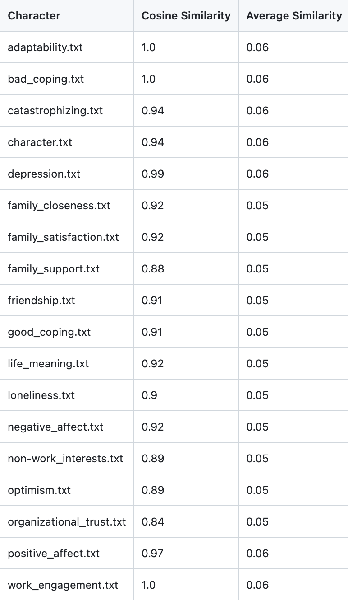
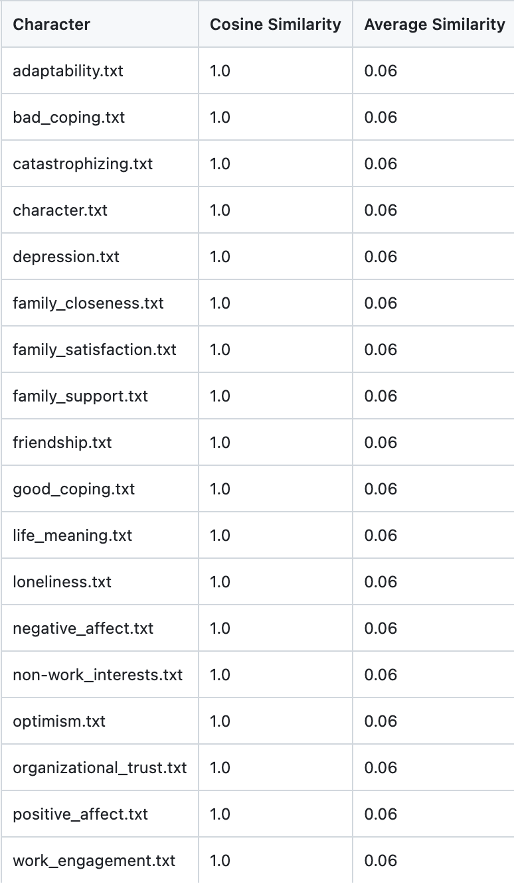

Army Doctrine Publication serves as the baseline document. 

<div>
<div class="column">
<p align="center" style= "margin-top: 50px;">
{width=90%}
*Similarity Analysis using BERT*
</p>
</div>

<div class="column">
<p align="center" style= "margin-top: 50px;">
{width=90%} 
*Similarity Analysis using GPT*
</p>
</div>
</div>

<div align= "center">

<p align="center" style= "margin-top: 50px;">
{width=80%}
Similarity of GAT doc to ADP
</p>
</div>
<br>
<br>

</p>
<br>
<br>
</div>

## *Verb Extraction and Analysis*

```{r echo = FALSE}
library(DT)
library(tidyr)
library(dplyr)

read.csv("../../data/verbs.csv") %>% 
  rename("Verb" = lemma, "Count" = count) %>%
  datatable(caption = 'Table 1: This is a simple caption for the table.',
    options = list(pageLength = 10, dom = 'tip'), rownames = FALSE)

read.csv("../../data/top_verb_phrases.csv") %>% select(-X) %>%
  rename("Verb" = lemma, "Count" = verb_count,
          "Cooccurring Word" = item2, 
         "Coccurence Count" = cooccurence_count) %>%
  datatable(caption = 'Table 1: This is a simple caption for the table.',
    options = list(pageLength = 10, dom = 'tip'), rownames = FALSE)

read.csv("../../data/verbs_gat.csv") %>% arrange(-verb_sum) %>% 
  mutate(document = stringr::str_remove(document, "GAT"),
         document = stringr::str_remove(document, ".txt"),
         document = stringr::str_replace_all(document, "_", " ")) %>%
  rename("Global Assessment Tool (GAT) Item" = document, "Verb Alignment (Count)" = verb_count, "Verb Alignment (Weighted Count)" = verb_sum) %>%
  datatable(caption = 'Table 1: This is a simple caption for the table.',
    options = list(pageLength = 10, dom = 'tip'), rownames = FALSE)
```

