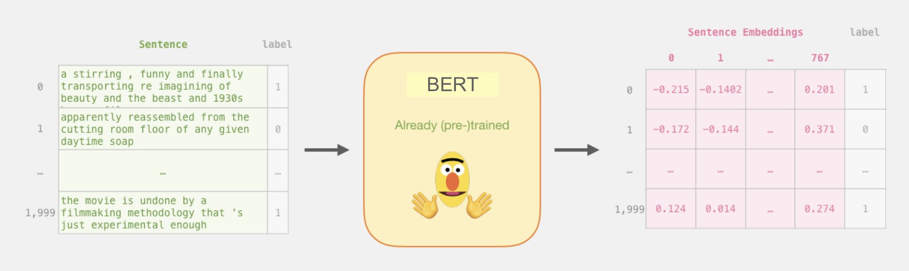

### Data Representation

<strong> Sentence Embeddings: </strong> Given that the data primarily comprises unstructured textual content, it becomes imperative to convert this data into a numerical format for effective comprehension by our models. As a result, we employ sentence embedding, a technique to extract features from text and feed them to machine learning models. They try to preserve syntactical and semantic information. Sentence Embedding or Sentence Vector is a numeric vector input that represents a word in a lower-dimensional space. It allows sentences with similar meaning to have a similar representation.

### Models
To perform document similarity between the GAT items and ADP we have harnessed the capabilities of Hugging Face's pretrained models, which have proven to be invaluable in such tasks. The models use sentence embeddings for document similarity analysis. Hugging face is an open source AI platform to create, build, and train models for open source collaboration. It provides users with the flexibility to download the pretrained models for their specific needs. Users can then train these models with their own data, fine-tuning them to suit the task at hand. 

1. <strong>BERT:</strong> Bidirectional Encoder Representations from Transformers is one of the extensively used hugging face model. Since this language model is bidirectionally trained, it can have a deeper sense of language context and flow than single-direction. BERT is designed to help computers understand the meaning of ambiguous language in text by using surrounding text to establish context. language models. 

{width=80%}

Generating Sentence Embeddings Using BERT 

2. <strong>GPT2:</strong> It is a transformer based language model designed to understand and generate human-like text by predicting the likelihood of words or sentences given the context provided to it. GPT-2 can perform various language-related tasks, such as generating coherent text, answering questions, completing sentences, and more. Its ability to generate contextually relevant responses has made it a powerful tool for natural language processing applications.

3. <strong>Clustering:</strong> K-means clustering is important in document analysis because it allows us to group similar documents together based on their content. It can be used to automatically categorize large sets of documents into distinct groups, making it easier to manage and retrieve relevant information.

### Metric
<strong>Cosine Similarity: </strong> It is used to measure the similarity between two documents based on their content. It calculates the cosine of the angle between two document vectors in a high-dimensional space, where each dimension represents a term (word) in the documents. Hence this was used to determine similarity between GAT items and ADP. Cosine similarity 1 implies high conceptual similarity. 

### Behavior Analysis

**Verb Extraction**: For this analysis, we decided to use verbs as a proxy for behaviors. We used the `nltk` R package to tag verbs within the Joint Universal Task List.  
**Co-occurrence**: To understand behaviors in context, we performed a co-occurrence analysis to find words that co-occurred with verbs.  
To connect behaviors to performance, we analyzed the frequencies of verbs present in both the Joint Universal Task List and the GAT Items.
